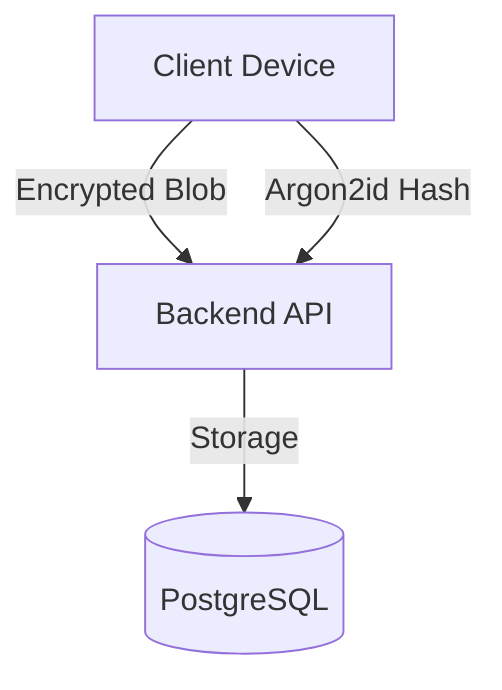

# PwmngerTS 🔐

**An open-source, zero-knowledge, cross-platform password manager built with TypeScript**

PwmngerTS is a secure, client-side encrypted password manager designed to work across web, browser extensions, and mobile/desktop platforms.
All encryption happens **locally on the user's device** — the server never sees plaintext passwords.

> Inspired by zero-knowledge architectures like Bitwarden, but built for learning, extensibility, and open collaboration.

---

## ✨ Features (v1.2.0)

- 🔐 **Zero-Knowledge Architecture:** Client-side encryption using Web Crypto API.
- 🎨 **Premium UI/UX:** Stunning high-performance landing page with dynamic mesh backgrounds and smooth transitions.
- 🧩 **Chrome Extension:** Secure browser integration with robust error handling and cloud sync.
- 📂 **Folder Organization:** Manage and categorize entries efficiently.
- 🛡️ **Two-Factor Authentication (2FA):** Secure login with TOTP enforcement.
- 🆘 **Account Recovery:** Restore access via Emergency Recovery Kit if password is lost.
- ⚡ **Performance Optimized:** Route-based lazy loading and optimized crypto operations.
- ☁️ **Secure Sync:** Encrypted blob synchronization to self-hosted backend.

---

## 🏗 Architecture Overview



**Security Guarantees:**

- Backend **NEVER** sees plaintext data.
- Master Password **NEVER** leaves the client device (Argon2id derivation).
- Data is encrypted with **AES-256-GCM**.

---

## 📁 Project Structure

```
PwmngerTS/
├─ apps/
│  ├─ web/          # Modern React Web Vault
│  ├─ extension/    # Browser Extension (Manifest V3)
│  └─ mobile/       # React Native App (In Progress)
│
├─ packages/
│  ├─ crypto/       # Shared Cryptography (Argon2id, AES-GCM)
│  ├─ appLogic/     # Vault & Auth Business Logic
│  ├─ vault/        # Shared Data Models
│  ├─ storage/      # Persistence Layer (IndexedDB/Chrome Storage)
│  └─ ui/           # Shared Component Library
│
├─ backend/         # Node.js + Prisma API
```

---

## 🚀 Getting Started

### Quick Start (Local Dev)

1.  **Clone & Install**

    ```bash
    git clone https://github.com/okikijesutech/PwmngerTS.git
    cd PwmngerTS
    pnpm install
    ```

2.  **Start Environment**

    ```bash
    # Starts Web, Backend, and Extension build in watch mode
    pnpm run dev
    ```

3.  **Access**
    - Web Vault: `http://localhost:5173`
    - API: `http://localhost:4000`

---

## 🚀 Deployment (Zero-Cost Hosting)

PwmngerTS is designed to be easily self-hosted using modern cloud providers with generous free tiers:

| Layer | Provider | Setup |
| :--- | :--- | :--- |
| **Frontend** | [Vercel](https://vercel.com) | Connect GitHub -> Select `apps/web` -> Deploy. |
| **Backend** | [Render](https://render.com) | Connect GitHub -> Select `backend` -> Deploy. |
| **Database** | [Supabase](https://supabase.com) | Create project -> Copy Connection String -> Add to Backend `.env`. |

> [!TIP]
> **See the full [DEPLOYMENT.md](file:///c:/Users/HP/desktop/pwmngerTS/DEPLOYMENT.md) for step-by-step setup and environment variables checklist.**

---

## 📦 Distribution (Manual Installation)

Until we are listed on official stores, you can install PwmngerTS manually:

### 🧩 Browser Extension
1.  Go to [Releases](https://github.com/okikijesutech/PwmngerTS/releases) and download `extension-build.zip`.
2.  Unzip the folder.
3.  Open `chrome://extensions` and enable **Developer Mode**.
4.  Click **Load Unpacked** and select the unzipped folder.

### 📱 Mobile (Android)
1.  Download the `PwmngerTS.apk` from the latest release.
2.  Enable **Install from Unknown Sources** in your device settings.
3.  Install and launch the app.

---

## 🧪 Testing

Tests are organized by module to ensure high reliability:

```bash
# Run all unit tests
pnpm test

# Run E2E tests (Playwright)
pnpm run test:e2e
```

- ✅ **Unit Tests**: Coverage for `@pwmnger/crypto`, `@pwmnger/vault`, and core logic.
- ✅ **Extension Tests**: UI and interaction testing for the browser extension.
- ✅ **E2E Tests**: Integration testing using Playwright.

---

## 🗺️ Roadmap

- [x] Browser extension version (Manifest V3)
- [x] Two-factor authentication (TOTP)
- [x] Major Performance Optimization (v1.1.0)
- [x] Vault Recovery Mechanism
- [x] Premium Landing Page UI (v1.2.0)
- [x] Extension Stability Fixes (v1.2.0)
- [ ] Mobile app (Expo/React Native) - *Building core logic*
- [ ] Auto-fill integration
- [ ] Passkey support

---

## 📜 License

This project is licensed under the **MIT License**.

---

**Built with ❤️ by the PwmngerTS community**
