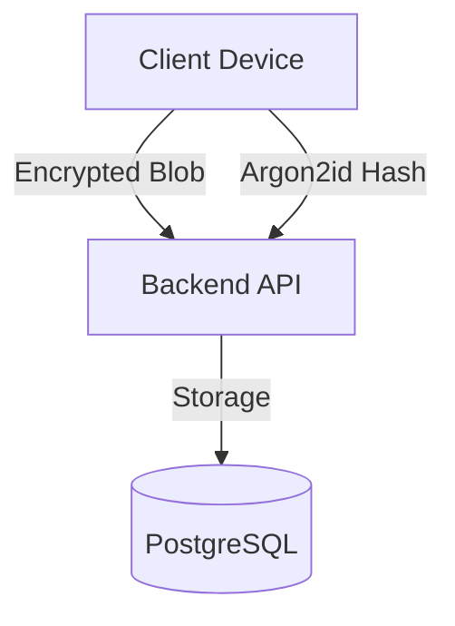

# PwmngerTS 🔐

**An open-source, zero-knowledge, cross-platform password manager built with TypeScript**

PwmngerTS is a secure, client-side encrypted password manager designed to work across web, browser extensions, and mobile/desktop platforms.
All encryption happens **locally on the user's device** — the server never sees plaintext passwords.

> Inspired by zero-knowledge architectures like Bitwarden, but built for learning, extensibility, and open collaboration.

---

## ✨ Features

- 🔐 **Zero-Knowledge Architecture:** Client-side encryption using Web Crypto API.
- 📂 **Folder Organization:** Manage and categorize entries efficiently.
- 🛡️ **Two-Factor Authentication (2FA):** Secure login with TOTP enforcement.
- 🆘 **Account Recovery:** Restore access via Emergency Recovery Kit if password is lost.
- 🩺 **Password Health:** Analyze vault for weak/reused credentials.
- ☁️ **Secure Sync:** Encrypted blob synchronization to self-hosted backend.
- 🌍 **Cross-Platform:** Web Vault and Browser Extension.

---

## 🏗 Architecture Overview



**Security Guarantees:**
- Backend **NEVER** sees plaintext data.
- Master Password **NEVER** leaves the client device.
- Data is encrypted with **AES-256-GCM**.

---

## 📁 Project Structure

```
PwmngerTS/
├─ apps/
│  ├─ web/          # React + Vite Web Vault
│  └─ extension/    # Browser Extension (Chrome/Edge)
│
├─ packages/
│  ├─ crypto/       # Shared Cryptography Library
│  ├─ appLogic/     # Core Business Logic
│  └─ vault/        # Types & Validation
│
├─ backend/         # Node.js API (Storage & Auth)
│
└─ docs/            # Documentation Portal
```

---

## 🚀 Getting Started

See the [User Guide](docs/USER_GUIDE.md) for how to use the application.

For developers and self-hosting:
- **Deployment**: See [Distribution Guide](docs/DISTRIBUTION.md)
- **Contributing**: See [Contributing Guidelines](docs/CONTRIBUTING.md)
- **Security**: See [Security Policy](docs/SECURITY.md)

### Quick Start (Local Dev)

1.  **Clone & Install**
    ```bash
    git clone https://github.com/okikijesutech/PwmngerTS.git
    npm install
    ```

2.  **Start Environment**
    ```bash
    # Starts Web, Backend, and Extension build
    npm run dev
    ```

3.  **Access**
    - Web Vault: `http://localhost:5173`
    - API: `http://localhost:4000`

### 4️⃣ (Optional) Start the backend

```bash
cd backend
npm run dev
```

Backend runs on: **http://localhost:4000**

### 5️⃣ Build the Extension

```bash
cd apps/extension
npm run build
```

Then load the `apps/extension/dist` directory as an **unpacked extension** in your browser.

---

## 🔐 Security Model

- ✅ All encryption is **client-side** (Web Crypto API)
- ✅ Master password derives encryption keys using **Argon2id**
- ✅ Vault encrypted with **AES-256-GCM**
- ✅ Backend stores only **encrypted blobs**
- ✅ No plaintext passwords transmitted or stored
- ☁️ Cloud Sync (Optional)

Cloud sync uses the Node.js backend to:

- Authenticate users (JWT)
- Store encrypted vault blobs
- Never decrypt vault data

Users can manually export/import vaults as encrypted JSON backups.

```bash
cd backend
npm run dev
```

Backend runs on: **http://localhost:4000**

### 5️⃣ Build the Extension

```bash
cd apps/extension
npm run build
```

Then load the `apps/extension/dist` directory as an **unpacked extension** in your browser.

---

## 🔐 Security Model

- ✅ All encryption is **client-side** (Web Crypto API)
- ✅ Master password derives encryption keys using **Argon2id**
- ✅ Vault encrypted with **AES-256-GCM**
- ✅ Backend stores only **encrypted blobs**
- ✅ No plaintext passwords transmitted or stored

⚠️ **Disclaimer**: This project is for **educational and experimental use**.
Do not rely on it for high-risk production secrets without a professional security audit.

See [docs/threat-model.md](docs/threat-model.md) for detailed security analysis.

---

## ☁️ Cloud Sync (Optional)

Cloud sync uses the Node.js backend to:

- Authenticate users (JWT)
- Store encrypted vault blobs
- Never decrypt vault data

Users can manually export/import vaults as encrypted JSON backups.

---

## 🧪 Testing

Tests are organized by module:

```bash
# Run all tests
npm test

# Test specific packages
npm run test:crypto      # Crypto functions
npm run test:vault       # Vault operations
npm run test:applogic    # App logic
npm run test:storage     # Storage layer
npm run test:integration # Full integration
```

**Test coverage:**

- ✅ Unit tests for crypto, vault, and storage
- ✅ Integration tests for vault operations
- ✅ Controller tests for API endpoints
- ⏳ E2E tests (planned)

---

## 🤝 Contributing

Contributions are welcome! Please see [CONTRIBUTING.md](CONTRIBUTING.md) for detailed guidelines.

**Quick start:**

1. Fork the repo
2. Create a feature branch (`git checkout -b feature/amazing-feature`)
3. Commit changes (`git commit -m 'Add amazing feature'`)
4. Push to branch (`git push origin feature/amazing-feature`)
5. Open a Pull Request

**Good first contributions:**

- UI improvements & styling
- Additional tests
- Accessibility improvements
- Documentation
- Bug fixes

---

## 🔐 Security Issues

**Do not open public issues for security vulnerabilities!**

Please report responsibly via:

- [GitHub Security Advisories](https://github.com/okikijesutech/PwmngerTS/security/advisories)
- See [SECURITY.md](SECURITY.md) for full details

---

## 📜 License

This project is licensed under the **MIT License** — see [LICENSE](LICENSE) for full details.

---

## 🧠 Motivation & Learning Goals

PwmngerTS was built to:

- ✅ Learn zero-knowledge architecture principles
- ✅ Practice client-side encryption
- ✅ Explore monorepo structure with TypeScript
- ✅ Build cross-platform apps (Web, Mobile, Extension)
- ✅ Create reusable crypto and vault packages

This is an open-source learning project. Feel free to fork, study, and improve!

---

## 🗺️ Roadmap

- [x] Browser extension version
- [ ] Mobile app (React Native)
- [ ] Two-factor authentication
- [ ] Password strength meter
- [ ] Auto-fill integration
- [ ] Passkey support
- [ ] End-to-end tests
- [ ] Professional security audit

---

## 📧 Contact & Support

- 🐛 **Issues:** Use [GitHub Issues](https://github.com/okikijesutech/PwmngerTS/issues)
- 💬 **Discussions:** Use [GitHub Discussions](https://github.com/okikijesutech/PwmngerTS/discussions)
- 📚 **Docs:** Check [docs/](docs/) directory

---

**Built with ❤️ by the PwmngerTS community**
